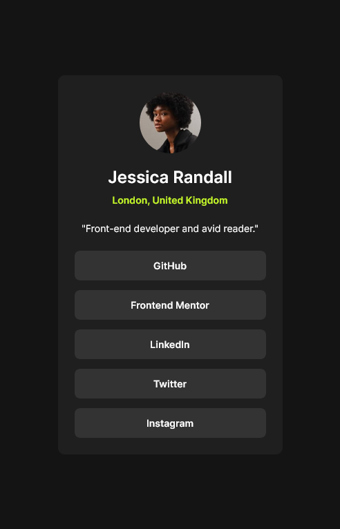
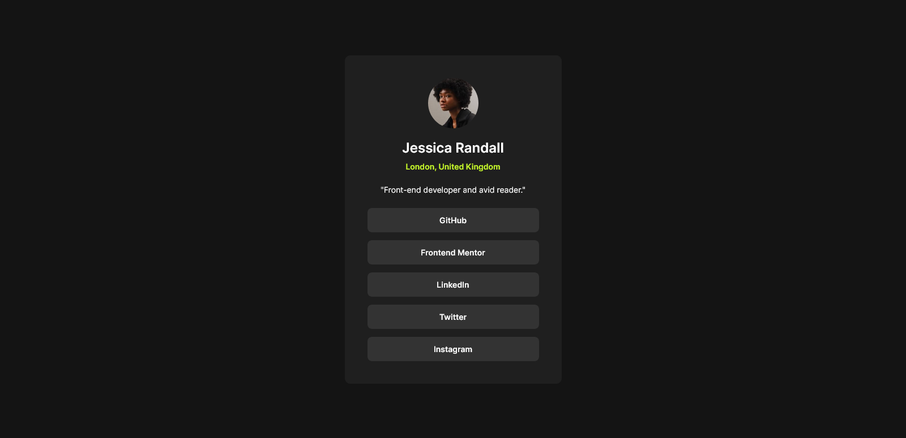

## Overview
This is a challenge for front-end mentor name social-links-profile-main

### Screenshot
Mobile view

desktop view

## My process
    I use block process

### Built with
- Semantic HTML5 markup
- CSS custom properties
- Mobile-first workflow

### What I learned
I learned that if that if you don't set the border for the parent the child margin then affect the parent to prevent this we need to set a border or padding on the parent element and since fonts were provided I also learned how to import them in CSS file

### Useful resources
- [child parent margin solution](https://www.geeksforgeeks.org/why-margin-on-child-element-moves-the-parent-element-in-css/) - This is where I learned about child parent margin problem

[DEMO](https://wajidkhan2-frontendmentor-challenges.github.io/social-links-profile-main-fm-html-css/)
